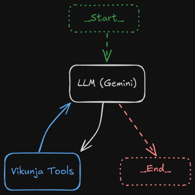

# VikunjAI

This is a demo project to demonstrate [LangChain](https://js.langchain.com/docs/introduction/) and [LangGraph](https://langchain-ai.github.io/langgraphjs/concepts/). The goal of this project is to create an ai agent workflow that can conversationally interact with a [Vikunja](https://vikunja.io/) instance to manage tasks

## Requirements

* Vikunja instance with API access
* Google Gemini API key
* Node.js v24
* pnpm

## Project Objectives

- [x] Conversation AI web interface
- [x] Model a LangGraph
- [x] Introduce a tool
- [ ] [**State**] Expand state beyond `messages`
- [ ] [**State**] Remove unnecessary messages from context
- [x] [**Tool**] List tasks in a project
- [ ] [**Tool**] Mark a task as done
- [ ] [**Tool**] Create a task
- [ ] [**Graph**] Expand graph to a more interesting workflow
- [ ] [**Graph**] Add human approval step
- [ ] [**Memmory**] Sync context with a database
- [ ] [**App**] Manage multiple conversations
- [ ] [**App**] Authentication
- [ ] [**App**] Streaming responses

## Agent Workflow

This is the workflow as it stands currently

